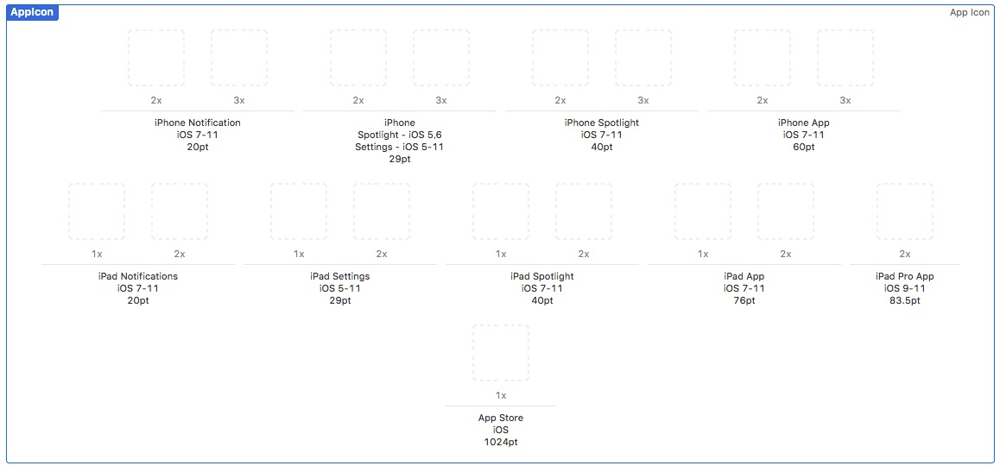

# Imagetools

Ruby製の画像ツールコレクションです。以下のツールを含みます(※はプレビュー版です)

- iconcreator(※): Xcodeで使用するアプリ用アイコンの作成
- iconextractor(※): .appからアイコン画像の抽出
- imageblog(※): ブログ用の連番画像生成(hugoを想定)
- imageburst(※): 動画ファイルを連続キャプチャ
- imageconcat: 画像の連結
- imagefilter: 画像変換(WordPress用画像を想定)
- imageresizer(※): 画像サイズ変換(WordPress用画像を想定)

一部外部コマンドを使用するため、macOS上のRuby 3.xでの動作を想定しています。

## インストール


ImageMagick v6が必要です。以下のコマンドでインストールします。

Homebrewの場合
```
brew uninstall imagemagick
brew install imagemagick@6
PKG_CONFIG_PATH=/usr/local/opt/imagemagick@6/lib/pkgconfig gem install imagetools
```

MacPosrtsの場合
```
sudo port install imagemagick
gem install imagetools
```

imagefilterを使用する場合、追加で以下の外部コマンドも必要です

- convert、mogrify: ImageMagicをインストールすれば使えるはず。
- dweb: WebP画像を扱う。
- exiftran: EXIF情報を削除。
- jpegoptim: JPEG画像の圧縮。

Homebrewの場合
```
brew install webp jpegoptim exiftran 
```

MacPortsの場合

```
sudo port install webp jpegoptim exiftran
```


## 使用方法

### imageconcat

画像ファイルを連結します。

image1.jpg、image2.jpg、image3.jpgを連結し、カレントフォルダにphoto.jpgを出力。
```
imageconcat image1.jpg image2.jpg image3.jpg
```

カレントフォルダに存在する画像ファイルを全て取得してソートして最後の2個を連結し、カレントフォルダにphoto.jpgを出力。
```
imageconcat -n 2 ~/tmp  
```

以下のオプションが指定可能です。

```
$ imageconcat
Usage: imageconcat [-h|--help] <dir> or <image1 image2 image3 ...>
    -h, --help                       Show this message

Examples:
    imageconcat ~/tmp # concat two recent IMG_*jpg images.
    imageconcat image1.jpg image2.jpg image3.jpg  # concat specified images.

Options:
    -v, --verbose                    Verbose message
        --dry-run                    Message only
    -o, --output=OUTNAME             Output file
    -n, --number=NUM                 Concat image number
```


### imagefilter

画像ファイルを適切に処理しブログで使いやすく変換します。

image1.pngが処理され、image1.jpgが作成されます。

```
imagefilter image1.png 
```

内部では以下の処理を順番に実行し、最終的にJPEGファイルを作成します。

- 画像のリネーム
- WebPのPNGへの変換
- PENGのJPEGへの変換
- JPEGのリサイズ
- 画像の回転(カメラで撮影した画像を適切な向きに)
- 画像の圧縮

一部の挙動は設定ファイル`~/.imagefilterrc`で制御できます。
ファイル名の検索・置換パターンが3つまでとリサイズ後の最大幅が指定できます。

```
filename:
    search1: s (\d+)-(\d+)-(\d+) (\d+)\.(\d+)\.(\d+)
    replace1: s_\1\2\3_\4\5\6
    search2: foo
    replace2: bar
    search3: fizz
    replace3: buzz    
resize: 
    width: 1280
```

Hazelなどの自動化ツールと組みあせると便利です。


### iconcreator 


オリジナル画像からiOS/macOSアプリ用のアイコンファイルを一気に生成します。リサイズするため、オリジナル画像は1024x1024以上の大きなサイズのものを準備します。




```
iconcreator -t ios -i icon.png -o .
```

実行すると、-oで指定した出力フォルダ内にAppIcon.appiconsetフォルダ、および必要なアイコンファイルが出力されます。このフォルダをXcodeプロジェクトのAssets.xcassetsフォル内にコピーします。Assets.xcassets内に存在する既存のAppIcon.appiconsetを起きえます。

自動的にアプリのアイコンとして認識されるはずです。


## License

The gem is available as open source under the terms of the [MIT License](https://opensource.org/licenses/MIT).

